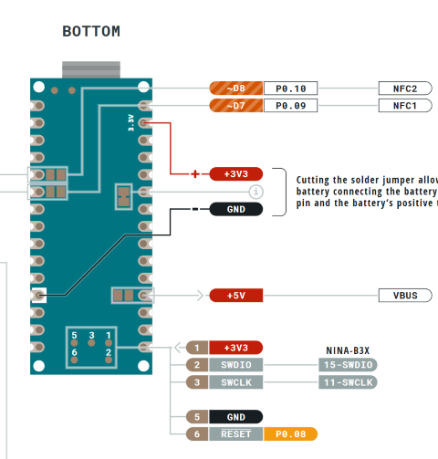

# Unbricking Seeed Studio Xiao BLE / Arduino Nano 33 BLE

As the Xiao BLE devel board is only having native USB used also for the programming it's quite easy to brick a whole module. The same applies for the Adruino Nano 33 BLE. The only way how to unbrick it is using debug pins SWDIO/SWDCLK.

## First brick (= what would happen if I try to add headers for hid mouse and keyboard)

After first incident I've been looking for HowTo's for unbricking XIAO BLE board and most helpful was [XIAO BLE (Sense) bootloader bricked, how to restore it?](https://forum.seeedstudio.com/t/xiao-ble-sense-bootloader-bricked-how-to-restore-it/263091/4) on Seeedstudio forum.

However there was quite a lot of issues:

1. The command line has special quote characters here, and if you just copy paste it, it'll be reporting weird errors (but none of them implies it's because of special quote characters). But ok, after few minutes fixed.
2. The openocd installed by apt was reporting weird errors about commands. After some time it was obvious it's openocd issue and I can't resolve it by tweaking scripts.
3. For some reason the first "pinout" for the Raspberry Pi Zero on the google is bullcrap (some pi4j.com site) -> rediscovered command `pinout` that prints correct pinout...
4. Compilation of the lates openocd takes some time and there is a change in SWDIO pin location (moved to GPIO8) - so **SWDCLK is on GPIO11 (23)** and **SWDIO on GPIO8 (24)**

### The final rescue (compiled openocd 0.12.0)

1. [Compile and install openocd on RPi](https://learn.adafruit.com/programming-microcontrollers-using-openocd-on-raspberry-pi/compiling-openocd)
2. Download: [Seeed_XIAO_nRF52840_Sense_bootloader-0.6.1_s140_7.3.0.hex](Seeed_XIAO_nRF52840_Sense_bootloader-0.6.1_s140_7.3.0.hex)
3. `sudo openocd -f interface/raspberrypi-native.cfg -c "transport select swd" -f target/nrf52.cfg -c init -c "reset init" -c halt -c "nrf5 mass_erase" -c "program Seeed_XIAO_nRF52840_Sense_bootloader-0.6.1_s140_7.3.0.hex verify" -c reset -c exit`

## Brick #2 (random example testing)

I don't like that soldered wires, lets take second board and test some sketches :D What could've possibly go wrong....

Now I've remembered I also have 1mm (in diameter) pogo pins and it should be possible to get them into 2x3 header and hold it on the test pads for the time of flashing bootloader. However Xiao doesn't have power suppy pad on 2x2 debug/flashing pads so it's connected through USB micro to USB-C cable and only SWD pins are on the pogo header.

This setup was used several times and in the combination with USP hat and ssh also quite comfortable. Eexcept for super short wires but it was solved right the way.

## Nano 33 BLE

After I bought Arduino Nano 33 BLE, which is using exactly the same principle for bootloader as Xiao BLE, I had to make 2x3 pad header adapter for programming.
I wanted to use ST-LINK on STM Nucleo board, but I wasn't able to get it working with openocd. On the windows it was complaining about unsuported libusb, on the raspberry about transport so I put that on hold and rewire the header for usage with RPi gpio.

### Upload command

    sudo openocd -f interface/raspberrypi-native.cfg -c "transport select swd" -f target/nrf52.cfg -c init -c "reset init" -c halt -c "nrf5 mass_erase" -c "program ArduinoNano33BLE_bootloader.hex verify" -c reset -c exit

Download: [ArduinoNano33BLE_bootloader.hex](ArduinoNano33BLE_bootloader.hex) (copied from Arduino core bootloaders directory)

### SWD pinout

The full pinout is available [here](https://content.arduino.cc/assets/Pinout-NANOble_latest.pdf).

## Future (if it will be too often)

If it'll be needed too often, I'll consider making either:

* service + RPi shield (two buttons + connectors to probe cables)
* service + "jumper" on each probe cable (2x20 pin header to Xiao's 1x2 pin SWD / 2x20 pin header to Nano 33 BLE 2x3 pin SWD)

### Dual ISP for Arduino Mega 2560 (service + shield variant)

The shield and service is quite well tested already for AVR ISP for loading firmwares into blank chips on own Arduino Mega clone. It sometimes restarts RPi, but the board itself has polyfuse and big capacitor for avoiding this scenario when ISP heaers are connected first. However if the USB is connected first instead to RPi's OTG USB, it'll often cause undervoltage reset. The 5V power rail on the RPi Zero is somehow super sensitive for connecting anything on it.

